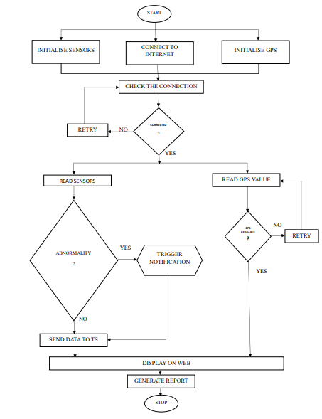

# Intelligent Sensor-Based Surveillance Jacket with AI-Powered Report Generation

## Introduction

The **Intelligent Sensor-Based Surveillance Jacket** is a wearable IoT system designed for continuous health monitoring across various age groups. It integrates multiple biomedical sensors with an ESP32 microcontroller to collect vital health data in real time. The data is transmitted to the ThingSpeak IoT platform and displayed on a dedicated web/mobile application. An AI-powered module analyzes the sensor data to generate health reports, detect abnormalities, and provide medical suggestions, enabling remote health surveillance and timely alerts.

This system targets children, adults (especially workers, soldiers, and women requiring safety alerts), and elderly people by providing real-time monitoring, fall detection, environmental adaptation, and emergency notifications.


---

## Features

* Real-time monitoring of vital signs: heart rate, blood oxygen (SpO2), temperature, and more
* Fall detection and emergency alerts via vibration and buzzer modules
* GPS tracking for location monitoring
* Environmental sensing including temperature, humidity, and gas detection
* Data visualization through ThingSpeak IoT platform
* AI-powered health report generation using OpenAI GPT API
* Web/mobile app interface for remote monitoring by caretakers or family members
* Adaptability to different environmental conditions for improved safety
* PDF report generation summarizing health data and AI insights

---

## Hardware Components

* ESP32 Microcontroller
* OLED Display
* Heart Rate Sensor Module
* MAX30102 Pulse Oximeter Sensor
* ADXL345 Accelerometer (for fall detection)
* DS18B20 Digital Temperature Sensor
* Neo 6M TTL GPS Module
* DHT11 Temperature and Humidity Sensor
* MQ3 Gas Sensor (for environmental gas detection)
* Buzzer (for alerts and notifications)

---

## Software & Tools

* Arduino IDE (for ESP32 programming)
* ThingSpeak (IoT data platform for real-time sensor data visualization)
* Flask (Python web framework for backend API and report generation)
* OpenAI GPT API (for AI-based analysis and health report generation)
* Web technologies: HTML, CSS, JavaScript (for dashboard and user interface)

---

## Installation & Setup

### Hardware Setup

1. Assemble the sensors and modules on the jacket and connect them to the ESP32 microcontroller (Check for the connections in the hardware code).
2. Power the ESP32 with a suitable power bank or USB source.
3. Ensure GPS and sensors are properly calibrated and functioning.

### Software Setup

1. Install Arduino IDE and add ESP32 board support.
2. Upload the ESP32 firmware to read sensor data and send it to ThingSpeak channels.
3. Set up ThingSpeak account and create channels to receive sensor data.
4. Clone/download the project repository containing the Flask backend and frontend dashboard code.
5. Install Python and required dependencies:

   ```bash
   pip install flask requests openai
   ```
6. Configure API keys for ThingSpeak and OpenAI in the backend configuration file.
7. Run the Flask server to enable AI report generation and dashboard access:

   ```bash
   python app.py
   ```
8. Access the web dashboard on the configured local/remote server URL.




---

## Usage

* Wear the jacket to continuously monitor health and environment.
* Sensor data is automatically uploaded to ThingSpeak and updated on the web dashboard.
* The AI module analyzes data periodically and generates detailed health reports in PDF format.
* Alerts for abnormalities or emergencies are triggered via vibration and buzzer.
* Caretakers can monitor health status remotely through the dashboard.

---

## Contact

Ranit Santra, Sai Kumar Reddy N, Sandeep Tripathi, Sagar N
Electronics and Communication Engineering Student
HKBK College of Engineering
